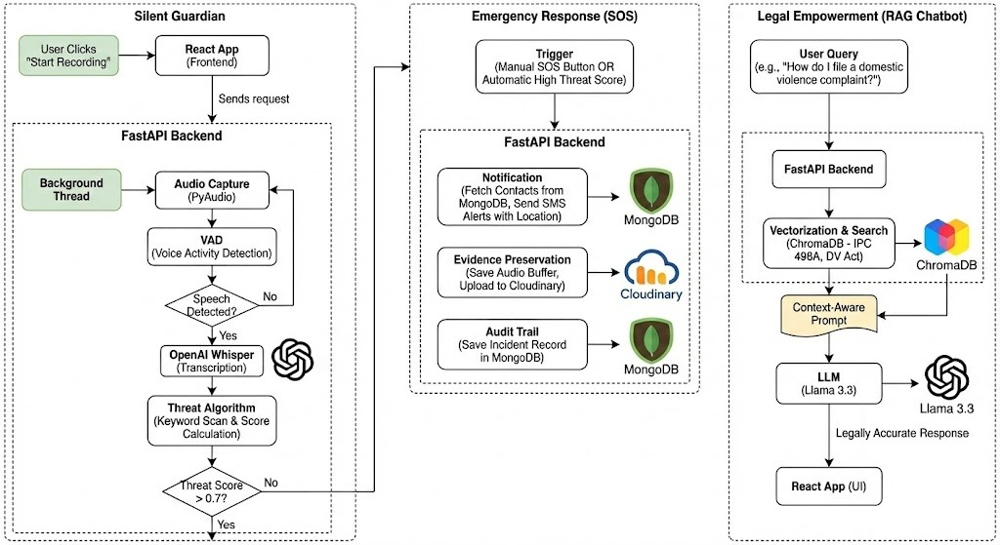
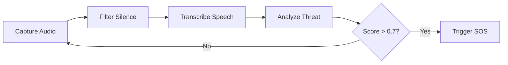

<div align="center">


# 🛡️ VoiceGuard: AI-Powered Domestic Violence Detection

### *Hear the Silence. Break the Cycle.*

[](https://opensource.org/licenses/MIT)
[](https://www.python.org/)
[](https://reactjs.org/)
[](https://fastapi.tiangolo.com/)

</div>

---

## 📖 Introduction

**VoiceGuard** is an AI-powered detection system designed to identify and intervene in instances of domestic violence. By analyzing real-time audio for patterns of distress, aggression, and violence, VoiceGuard provides a lifeline to victims, connecting them with immediate help from emergency services, trusted contacts, and support organizations. 

> **Our mission:** Leverage technology to create a safer environment and break the cycle of abuse.

---

## 🏗️ System Architecture

VoiceGuard operates on a **three-pillar system**: 

- **Prevention** (Passive Audio Monitoring)
- **Protection** (Active SOS & Evidence Recording)
- **Empowerment** (Legal Intelligence)

<p align="center">

</p>

---

## ✨ Key Features

| Icon | Feature | Description |
|:----:|:--------|:------------|
| 🎙️ | **Real-time Monitoring** | Continuously listens for audio cues in the background with a privacy-first approach |
| 🧠 | **AI Threat Detection** | Utilizes advanced machine learning to detect distress patterns, threats, and indicators of violence |
| 🤖 | **RAG-Powered Legal AI** | **NEW:** "Asha" chatbot uses Vector Search (ChromaDB) to retrieve accurate Indian legal context (IPC 498A, DV Act) before answering |
| 🆘 | **Emergency SOS Alerts** | Instantly notifies trusted contacts and local authorities with location details during a crisis |
| 🗄️ | **Secure Evidence Locker** | Automatically records and uploads encrypted audio evidence to Cloudinary for legal admissibility |
| 📝 | **Auto-Drafting** | **NEW:** Instantly generates legally valid drafts for FIRs and Protection Orders based on user input |
| 🌐 | **Multilingual Support** | Offers support for multiple Indian languages (English, Hindi, Bengali, Tamil, Telugu, Marathi) |
| 🕶️ | **Stealth Mode** | Features a "Quick Exit" button and can disguise itself as a calculator or weather app |

---

## 🎥 Watch the Demo

<p align="center">
<strong>Click the thumbnail below to see a full walkthrough of VoiceGuard's features</strong>
</p>

<p align="center">
<a href="https://youtu.be/fml2F7navW4" title="Watch the Demo Video">

</a>
</p>

---

## 📸 Screenshots

<details>
<summary><strong>Click to view screenshots</strong></summary>

### Main Dashboard
<p align="center">

</p>

### Disguised Interface
<p align="center">

</p>

### Multilingual Support
<p align="center">

</p>

</details>

---

## ⚙️ How It Works

### 1. 🛡️ Silent Guardian (Audio Pipeline)



- **Capture:** Python backend captures audio via PyAudio
- **Filter:** WebRTC VAD filters out silence to save resources
- **Transcribe:** OpenAI Whisper converts speech to text
- **Analyze:** NLP algorithms scan for distress keywords and calculate a Threat Score

### 2. 🚨 Emergency Response

- **Trigger:** If Score > 0.7, the SOS protocol initiates
- **Notify:** Backend fetches trusted contacts from MongoDB and sends SMS alerts
- **Preserve:** Audio buffer is saved and uploaded to Cloudinary

### 3. ⚖️ Legal Empowerment (RAG Engine)

- **Query:** User asks a legal question (e.g., "How do I file a case?")
- **Search:** System vectorizes the query and searches ChromaDB for relevant legal acts
- **Generate:** Llama 3.3 (via OpenRouter) synthesizes the legal context into an empathetic, accurate answer

---

## 🛠️ Technology Stack

<table>
<tr>
<td valign="top" width="33%">

### Backend & AI
-  Python
-  FastAPI
-  Whisper
-  Llama 3.3
- ChromaDB (Vector DB)
- WebRTC VAD

</td>
<td valign="top" width="33%">

### Data & Storage
-  MongoDB
-  Cloudinary
- Clerk Auth

</td>
<td valign="top" width="33%">

### Frontend
-  React
-  Vite
-  Tailwind CSS
- Recharts

</td>
</tr>
</table>

---

## 🚀 Getting Started

### 📋 Prerequisites

- Python 3.8+
- Node.js and npm
- MongoDB Atlas, Cloudinary, and Clerk accounts
- OpenRouter API Key (for Llama 3.3)

### 🔧 Backend Setup

1. **Clone the repository**
   ```bash
   git clone https://github.com/nakul-verma2/voiceguard.git
   cd voiceguard/backend
   ```

2. **Create and activate virtual environment**
   ```bash
   python -m venv venv
   
   # Windows
   .\venv\Scripts\activate
   
   # Mac/Linux
   source venv/bin/activate
   ```

3. **Install dependencies**
   ```bash
   pip install -r requirements.txt
   ```

4. **Environment Variables**
   
   Create a `.env` file in the backend directory:
   ```env
   OPENAI_API_KEY=your_key_here
   MONGO_URI=your_mongodb_uri
   CLOUDINARY_CLOUD_NAME=your_cloud_name
   CLOUDINARY_API_KEY=your_api_key
   CLOUDINARY_API_SECRET=your_api_secret
   CLERK_SECRET_KEY=your_clerk_key
   ```

5. **Run the Server**
   ```bash
   uvicorn main:app --host 0.0.0.0 --port 5000 --reload
   ```

### 💻 Frontend Setup

1. **Navigate to frontend**
   ```bash
   cd ../frontend
   ```

2. **Install dependencies**
   ```bash
   npm install
   ```

3. **Run development server**
   ```bash
   npm run dev
   ```

4. Open `http://localhost:5173` in your browser

---

## 🤝 Contributing

Contributions are what make the open-source community such an amazing place to learn, inspire, and create. Any contributions you make are **greatly appreciated**.

1. Fork the Project
2. Create your Feature Branch (`git checkout -b feature/AmazingFeature`)
3. Commit your Changes (`git commit -m 'Add some AmazingFeature'`)
4. Push to the Branch (`git push origin feature/AmazingFeature`)
5. Open a Pull Request

---

## 📜 License

Distributed under the **MIT License**. See `LICENSE` for more information.

---

## 👥 Team

<div align="center">

### Made with ❤️ by **BlackOps**

[⭐ Star this repo](https://github.com/nakul-verma2/voiceguard) | [🐛 Report Bug](https://github.com/nakul-verma2/voiceguard/issues) | [💡 Request Feature](https://github.com/nakul-verma2/voiceguard/issues)

</div>

---

<div align="center">
<sub>VoiceGuard - Empowering victims, preventing violence, saving lives.</sub>
</div>
