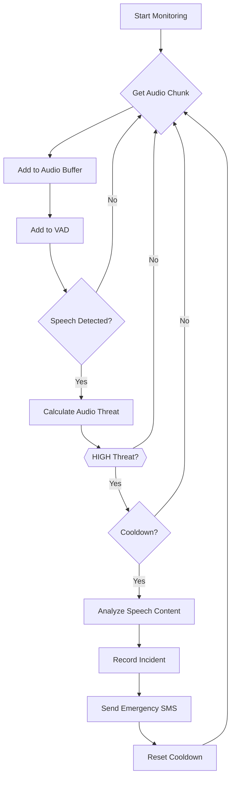

# VoiceGuard (`main1.py`) Workflow

This document outlines the workflow of the `main1.py` script, the core of the VoiceGuard domestic violence detection system. It details how audio is captured, analyzed for threats, and how incidents are recorded and acted upon.

## Components

The script utilizes several key components:

- **AudioCapture**: Continuously captures audio from the microphone.
- **VoiceActivityDetector (VAD)**: Detects speech in the captured audio stream.
- **IncidentRecorder**: Records details of detected incidents, including audio evidence.
- **AudioBuffer**: Temporarily stores recent audio chunks.
- **SpeechAnalyzer**: Transcribes audio to text and analyzes it for threat levels.
- **sos**: Sends an SMS alert to emergency contacts.

## Workflow Diagram (Mermaid)

## Detailed Workflow Steps

1.  **Initialization**: The script starts by initializing all the necessary components, including the audio capture, VAD, incident recorder, audio buffer, and speech analyzer. It also sets up parameters for incident detection, such as the high threat threshold and cooldown time.

2.  **Start Monitoring**: The `AudioCapture` component begins recording audio from the microphone.

3.  **Main Loop**: The script enters an infinite loop to continuously process audio.

4.  **Get Audio Chunk**: In each iteration, a chunk of audio data is retrieved from the `AudioCapture` component.

5.  **Buffering**: The audio chunk is added to the `AudioBuffer`, which keeps a rolling history of the most recent audio.

6.  **Voice Activity Detection**: The audio chunk is also fed into the `VoiceActivityDetector`.

7.  **Speech Detection Check**: The VAD determines if the audio chunk contains speech.
    *   If **no speech** is detected, the loop continues to the next audio chunk.
    *   If **speech is detected**, the script proceeds to the threat analysis phase.

8.  **Audio Threat Calculation**: The script calculates the threat level based on audio properties like volume and VAD speech confidence. The threat is categorized as `LOW`, `MEDIUM`, or `HIGH`.

9.  **High Threat Check**: The script checks if the calculated threat level is `HIGH`.
    *   If it is **not a high threat**, the loop continues.
    *   If it is a **high threat**, the script checks if the cooldown period since the last incident has passed.

10. **Cooldown Check**: This ensures that alerts are not sent too frequently.
    *   If the system is in **cooldown**, the loop continues.
    *   If the **cooldown period has elapsed**, the script proceeds to a more in-depth analysis.

11. **Speech Content Analysis**: The `SpeechAnalyzer` processes the recent audio from the buffer to transcribe it and analyze the text for threats.

12. **Record Incident**: The `IncidentRecorder` saves the incident details, including the threat level, audio metrics, transcribed text, and the audio evidence itself.

13. **Send Emergency SMS**: The `sos` function is called to send an SMS alert to a pre-defined emergency contact.

14. **Reset Cooldown**: The timestamp of the last incident is updated, and the consecutive high-threat counter is reset, effectively starting the cooldown period again.

15. **Continuous Monitoring**: The loop then returns to processing the next audio chunk, continuing the monitoring process.

16. **Shutdown**: The process can be stopped by a `KeyboardInterrupt` (Ctrl+C). Upon stopping, it prints a summary of the session, including the number of incidents recorded.
